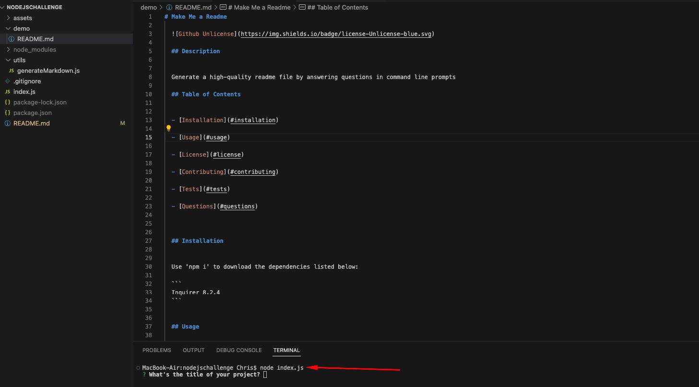
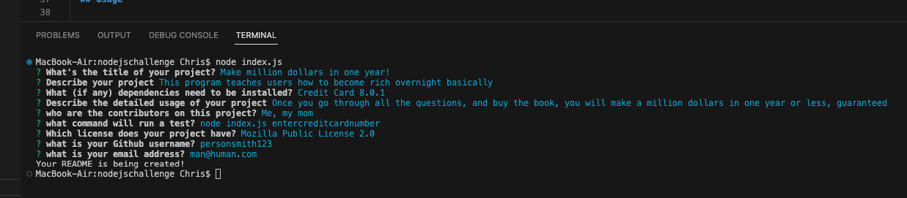
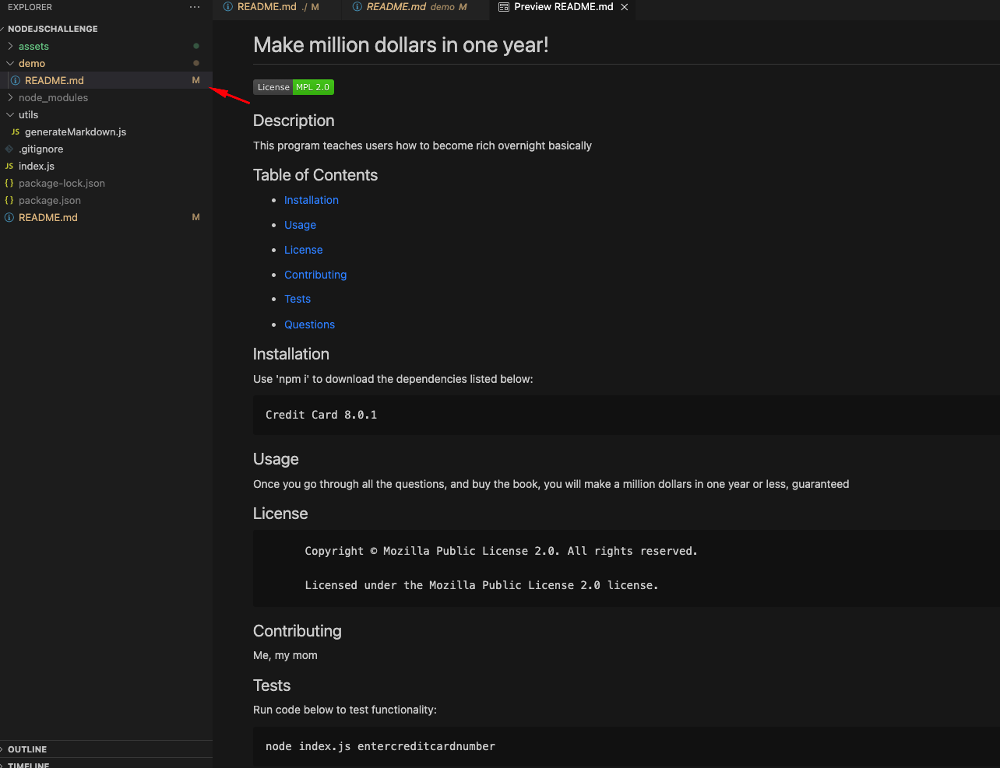

# **Make Me a Readme: Professional Readme Generator**


Link to Github Repo: 
```
https://github.com/chrisgom113/make-me-a-readme
```
Link to walkthrough video:
``` 
https://drive.google.com/file/d/1gRHjsfgJiR4h3HY4dwi35Do4ZZh45sBF/view
```

# Description

This project exhaustively prompts student to draw on hastily-learned concepts of node.js, npm, third-party packages, and command line-to-file writing system interfacing. The topics are dense and abstract.
Using starter code, student is asked to create a program that is run from the command prompt to generate questions. These questions are dynamically implementing the entered answers to a readme file. It requires the use of an index.js file as well as a separate js file that uses object-template literals to dynamically add input data to the readme file. At the end, a nice and tidy looking readme file is created that places answers from the command prompt in their appropriate section of the readme. Definitely tests the abilities of the student to learn difficult concepts and render them to realworld applications.


# Installation


Use 'npm i' to download the dependencies listed below:

```
Inquirer 8.2.4
```


# Usage

This walkthrough video demonstrates the functionality in real-time: https://drive.google.com/file/d/1gRHjsfgJiR4h3HY4dwi35Do4ZZh45sBF/view. 

The below description and screenshots also demonstrate some of the program's back-end coding.
  
## User invokes program by entering “node index.js” into the command line and is presented with questions.




## User enters the main data elements found in a typical high-quality readme file in response to the questions. 



## Once finished, user sees a newly-generated readme file in the “demo” folder of the repository.



 
 
# License

None
  